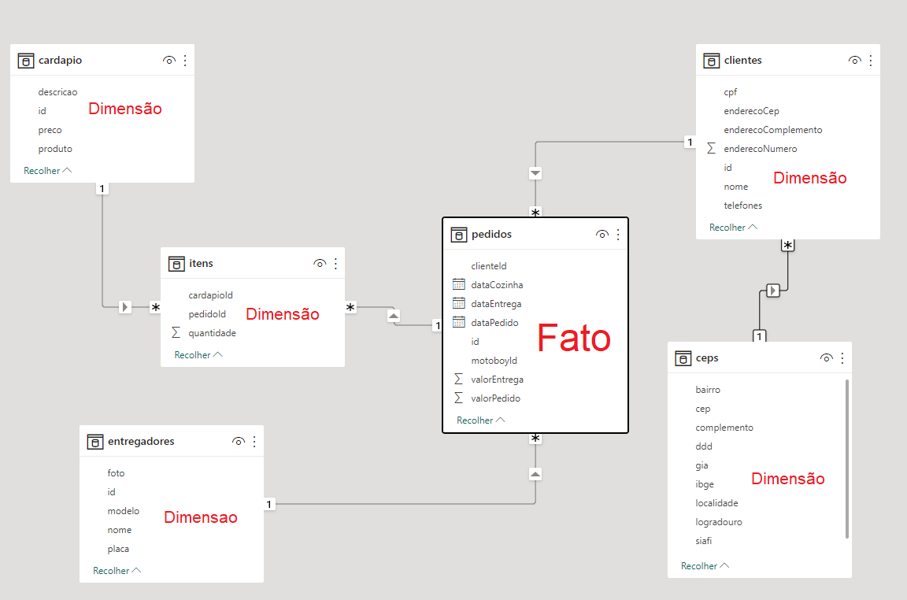

# Aula04 - Relacionamentos

## Link Meet: https://meet.google.com/uhq-yibx-mwz

# Relacionamentos no Power BI

Este guia apresenta uma visão geral sobre como criar e gerenciar relacionamentos entre tabelas no Power BI, um recurso essencial para desenvolver relatórios dinâmicos e interativos. Aprender a configurar relacionamentos corretamente é fundamental para garantir que suas visualizações e métricas reflitam os dados com precisão.

## O que são Relacionamentos?

Em Power BI, um relacionamento é uma conexão entre duas ou mais tabelas que permite a análise cruzada de dados. A criação de relacionamentos permite que os dados sejam filtrados e combinados para análises complexas sem a necessidade de mesclar tabelas manualmente. Cada relacionamento é baseado em uma ou mais colunas correspondentes que atuam como chaves entre as tabelas.

## Tipos de Relacionamento

No Power BI, os relacionamentos entre tabelas são classificados em dois tipos principais:

### Relacionamento "Um-para-Muitos" (1:*):
- É o tipo de relacionamento mais comum, onde uma linha de uma tabela está relacionada a várias linhas de outra.
- Exemplo: Uma tabela de Clientes (cada cliente é único) que se relaciona com uma tabela de Vendas (um cliente pode ter múltiplas vendas).

### Relacionamento "Muitos-para-Muitos" (:*):
- Relacionamento onde múltiplas linhas em uma tabela podem corresponder a múltiplas linhas em outra tabela.
- Usado em casos específicos onde não há uma chave única em ambas as tabelas, e o Power BI gerencia automaticamente uma tabela de interseção.

## Criando Relacionamentos no Power BI

### Passo 1: Ir para o Model View
No Power BI, vá para a exibição de Modelagem (Model View) para ver e gerenciar as tabelas e seus relacionamentos.

### Passo 2: Configurar Relacionamentos
Clique e arraste uma coluna de uma tabela para outra coluna na tabela de destino. O Power BI tentará automaticamente identificar o tipo de relacionamento com base nos dados.

### Passo 3: Ajustar Configurações de Relacionamento
Ao configurar o relacionamento, você verá algumas opções adicionais:

- **Cardinalidade**: Escolha entre "Um-para-Muitos" ou "Muitos-para-Muitos".
- **Direção de Filtro Cruzado**: Selecione a direção do filtro para determinar como os dados fluem entre as tabelas (pode ser "Ambos" ou "Único").
- **Aplicar Segurança de Filtro em ambas as direções**: Utilizado em cenários de segurança em nível de linha.

## Exemplos de Relacionamento

### Tabela de Vendas e Produtos:
- **Relacionamento**: Produtos[ID Produto] ↔ Vendas[ID Produto]
- **Tipo**: Um-para-Muitos
- **Direção de Filtro**: Ambos (útil para calcular vendas de produtos específicos).

### Tabela de Clientes e Vendas:
- **Relacionamento**: Clientes[ID Cliente] ↔ Vendas[ID Cliente]
- **Tipo**: Um-para-Muitos
- **Direção de Filtro**: Único (somente da tabela de Clientes para Vendas).

## Boas Práticas para Relacionamentos

- **Evite Relacionamentos "Muitos-para-Muitos"**: Sempre que possível, ajuste seus dados para que tenham chaves únicas em uma das tabelas.
- **Simplifique a Direção de Filtro**: Use a direção "Ambos" apenas quando necessário para evitar problemas de desempenho.
- **Renomeie Colunas de Chave**: Dê nomes claros às colunas usadas em relacionamentos para facilitar a leitura do modelo.

## Solução de Problemas

- **Valores Duplicados**: Se um erro indicar valores duplicados, verifique se a coluna de chave realmente contém valores únicos.
- **Relatório Mostra Dados Inconsistentes**: Revise a direção do filtro entre as tabelas e considere ajustar o relacionamento.
- **Relacionamentos Inativos**: Caso o Power BI desative um relacionamento, verifique se há caminhos indiretos entre as tabelas.

### Atividade 01
Relacionamento de dados e arquivos JSON: em outra pasta salve os dados de um restaurante, que estão no repositório **/restaurante**, importe estes dados em um novo projeto Power BI e crie os relacionamentos conforme imagem a seguir:
 
  Ao concluir os relacionamentos, faça um ou dois dashboards analisando os dados para mostrar as seguintes informações.
- Faturamento total do restaurante
- Entregas por entregador
- Pedidos no local (sem entrega)
- Tempo médio na cozinha
- Tempo médio de entrega

